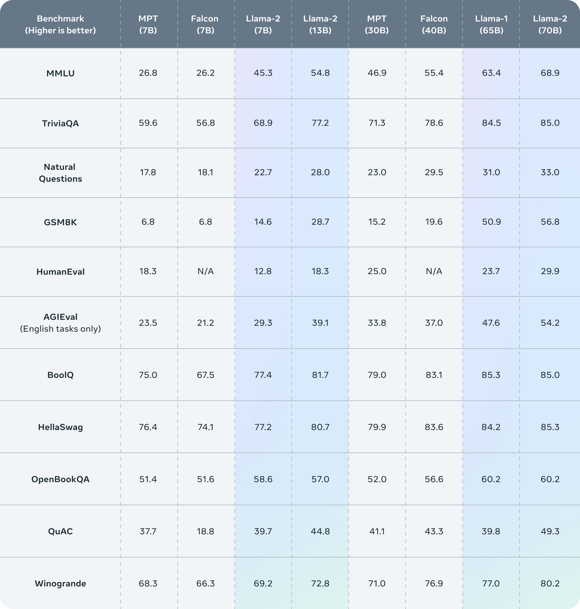
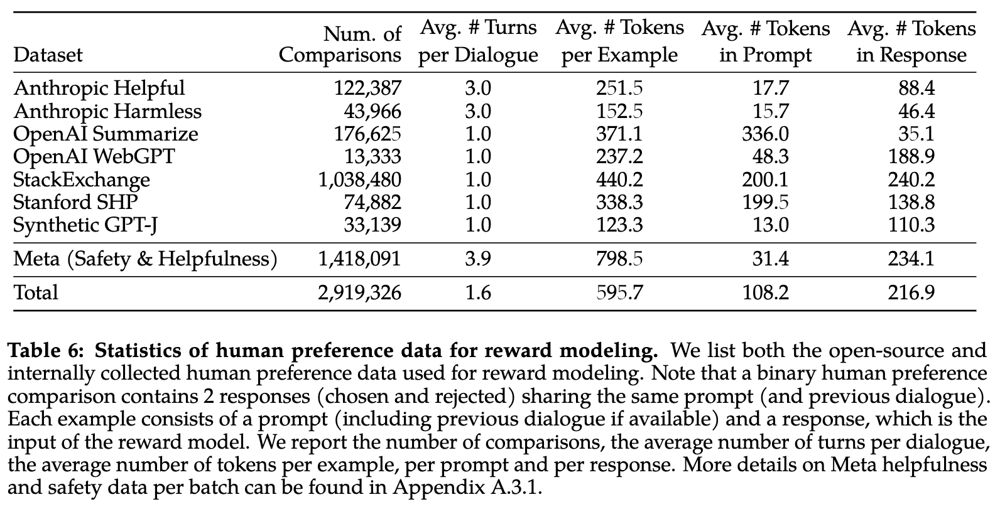
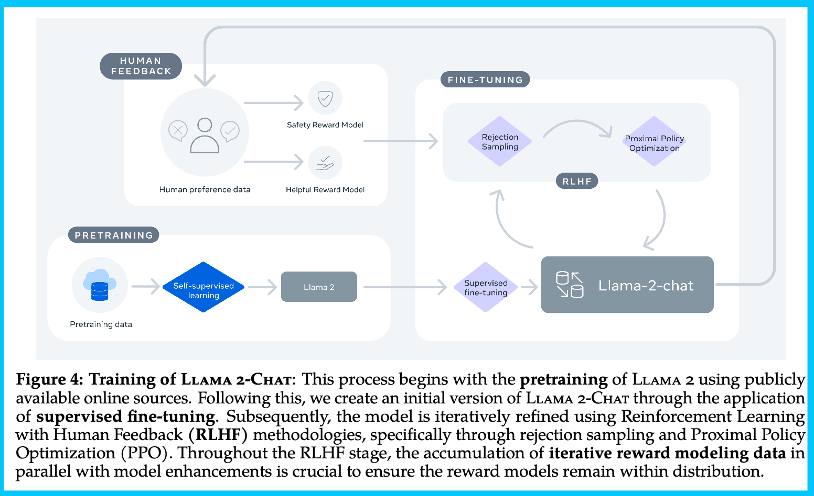

---
categories:
- LLM
- Llama 2
date: '2023-08-21'
description: LLaMA 2, the successor of the original LLaMA 1, is a large language model created by Meta. 
layout: post
title: 'Everything you need to know about Llama 2'
toc: true
image: llama2.png
---

# Everything you need to know about Llama 2

LLaMA 2, the successor of the original LLaMA 1, is a massive language model created by Meta. It is open for both research and commercial purposes, made available through various providers like AWS and Hugging Face. The pretrained models of LLaMA 2 have undergone extensive training on an impressive 2 trillion tokens, offering twice the context length compared to LLaMA 1. Additionally, its fine-tuned models have been refined using over 1 million human annotations.

# What is llama 2?

LLaMA 2 is the new state-of-the-art open large language model (LLM), released by Meta. LLaMA 2 represents the next iteration of LLaMA and comes with a commercially-permissive license. LLaMA 2 comes in 3 different sizes - 7B, 13B, and 70B parameters. The pretrained models come with significant improvements over the Llama 1 models, including being trained on 40% more tokens (around 2 trillion tokens), having a much longer context length (4k tokens), and using grouped-query attention for fast inference of the 70B model. 

## Is it trully open sourced?

Technically, the whole project is not open-source because the development and use of it is not fully available to the entire public. While the model is open to public, it is very *useful for the open-source community*, but we should call it an open release instead of open source.

## What is Llama 2 base and Llama 2 chat?

The base models are uncensored, and are not instruct-tuned or chat-tuned.

The chat models are censored, and have been chat-tuned, are optimized for dialogue use cases. 

# Where can I try it for free?

There are several free playgrounds to try out Llama 2: 

1. [HuggingChat](https://huggingface.co/chat) allows you to chat with the LLaMA 2 70B model through Hugging Face's 
conversational interface. 
2. [Perplexity chat](https://labs.perplexity.ai/) has both the 7B, 13B and 70B LLaMA 2 models on their chat interface.
3. [https://llama2.ai/](https://llama2.ai/) created by a16z 
4. 13B-chat model by [Pietro](https://twitter.com/skirano/status/1681381051237556224): [https://llama-2.replit.app](https://llama-2.replit.app/) 

# Where I can download it directly?

There are several ways to download Llama 2 models directly to your machine: 

1. You can download any of the LLaMA 2 models [directly from Meta](https://ai.meta.com/llama/). You’ll be required to input some personal information and agree to the community licence agreement and acceptable use policy first, and this will submit your request. You’ll get a follow-up email giving you the 
unique URL you need to initiate the download from GitHub.
2. You can also download the models from [Hugging Face](https://huggingface.co/docs/transformers/main/model_doc/llama2), a community platform for sharing machine learning models and datasets. However, you’ll need to have access granted by Meta first, agreeing to the same terms, and your Hugging Face account email must match what you provided in your request to Meta.

# **How good is LLaMA 2?**

- In the [annoucement](https://ai.meta.com/llama/) of Meta, they claim that Llama 2 outperforms other open source language models on many external benchmarks, including reasoning, coding, proficiency, and knowledge tests.
    
    
    

- In the [Huggingface Open LLM Leaderboard](https://huggingface.co/spaces/HuggingFaceH4/open_llm_leaderboard), the top ranking is flooded by the base model Llama 2 and its instruction-tuned models.
- This is the first time we can see an open LLM model is **on the level of ChatGPT (except in coding), while t**here is still a large gap in performance between Llama 2 70B and GPT-4
and PaLM-2-L. **** [Source](https://arxiv.org/pdf/2307.09288.pdf)
    
    
    

# How to finetune Llama 2 with our own data?

There is a bunch of great sources available for finetuning Llama 2 with your own data:

1. [Fine-tune 7B model Llama 2  in Google Colab](https://colab.research.google.com/drive/1PEQyJO1-f6j0S_XJ8DV50NkpzasXkrzd?usp=sharing#scrollTo=crj9svNe4hU5): This could even run with free version.
2. [Extended Guide: Instruction-tune Llama 2](https://www.notion.so/Everything-you-need-to-know-about-Llama-2-922143286f6e4663b0a38c3e29d20f56?pvs=21)
3. [Fine-tuning with PEFT](https://huggingface.co/blog/llama2#fine-tuning-with-peft)
4. [The EASIEST way to finetune LLAMA-v2 on local machine!](https://www.youtube.com/watch?v=3fsn19OI_C8)
5. [Finetuning recipe from Meta](https://github.com/facebookresearch/llama-recipes/tree/main#fine-tuning)
6. [Fine-Tuning LLaMA 2 Models using a single GPU, QLoRA and AI Notebooks](https://blog.ovhcloud.com/fine-tuning-llama-2-models-using-a-single-gpu-qlora-and-ai-notebooks/)

## How to extend context for LLama 2, beyond 4K?

We can extend context from 4K to 8k, 32k or 128k tokens with technique using [Position Interpolation](https://arxiv.org/abs/2306.15595) 

- **[Extending Context is Hard…but not Impossible](https://www.notion.so/Everything-you-need-to-know-about-Llama-2-922143286f6e4663b0a38c3e29d20f56?pvs=21):** awesome blog on the subject
- **[Long-Context](https://github.com/abacusai/Long-Context):** Extending LLM Context Length. A range of experiments with different schemes for extending context length capabilities of Llama, which has been pretrained on 2048 context length with the RoPE (Rotary Position Embedding) encoding.

# **How to deploy LLama 2?**

LLaMA 2 can be deployed in local environment ([llama.cpp](https://github.com/ggerganov/llama.cpp)) or using managed services like [Hugging Face Inference Endpoints](https://ui.endpoints.huggingface.co/)

Some other resources: 

- [exllama](https://github.com/turboderp/exllama):  A more memory-efficient rewrite of the HF transformers implementation of Llama for use with quantized weights.
- [CTranslate2](https://github.com/OpenNMT/CTranslate2): Fast inference engine for Transformer models
- [ctransformers](https://github.com/marella/ctransformers): Python bindings for the Transformer models implemented in C/C++ using GGML library.
- [vLLM](https://vllm.readthedocs.io/en/latest/): supports distributed inference
- [Text Generation Inference](https://github.com/huggingface/text-generation-inference) from Hugging face, has some nice features like telemetry baked in ([via OpenTelemetry](https://opentelemetry.io/docs/concepts/signals/traces/)) and integration with the HF ecosystem like [inference endpoints](https://huggingface.co/inference-endpoints). One thing to note that as of 7/28/2023, the license for TGI was changed to be more **[restrictive that may interfere with certain commercial uses](https://github.com/huggingface/text-generation-inference/commit/bde25e62b33b05113519e5dbf75abda06a03328e)**.
- [llama2.c](https://github.com/karpathy/llama2.c) : Inference Llama 2 in one file of pure C from karpathy

This [blog post](https://betterprogramming.pub/frameworks-for-serving-llms-60b7f7b23407) covers an overview for these frameworks for serving LLMs.

# Deep dive into Llama 2

## What is training data for base model?

> Our training corpus includes a new mix of data from publicly available sources, which does not include data from Meta’s products or services. We made an effort to remove data from certain sites known to contain a high volume of personal information about private individuals. We trained on 2 trillion tokens of data as this provides a good performance–cost trade-off, up-sampling the most factual sources in an effort to increase knowledge and dampen hallucinations. [source](https://arxiv.org/pdf/2307.09288.pdf)
> 

That’s simply all details that Meta gives in their paper, although we are very curious about which datasets contain a high volume of personal information or their detailed technique about up-sampling the factural sources.

## What is preference data for reward model?

First of all, the reward model is the key of RLHF. In order to get a good reward model, Meta had to push hard on gathering preference data extremely upgraded from what the open-source community is working with.

In summary, the key points about preference data: 

- Use **multi-turn preferences**, where model responses are taken **from different model checkpoints** with varying temperatures to generate diversity between pairs.
- binary comparison: either their choice is significantly better, better, slightly better, or negligibly better/ unsure.
- Focus on **helpfulness and safety** (as opposed to honesty), using separate guidelines at data collection time for each data vendor (e.g. safety is often a much more deceptive prompting style). This is most contrasted to Anthropic's works, where they train a model that is Helpful, Honest, and Harmless.
- I**terative collection for distribution management**: "Human annotations were collected in batches on a weekly basis. As we collected more preference data, our reward models improved, and we were able to train progressively better versions for Llama 2-Chat"
- The team added additional **safety metadata** to the collection showcasing which responses are safe from the models at each turn. When this is passed to the modeling phase, they "do not include any examples where the chosen response was unsafe and the other response safe, as we believe safer responses will also be better/preferred by humans."

## How to train reward models?

The reward model takes a model response and its corresponding prompt (including contexts from previous turns) as inputs and outputs a scalar score to indicate the quality (e.g.,helpfulness and safety) of the model generation. 

They train **two separate reward models**, one optimized for helpfulness (referred to as Helpfulness RM) and another for safety (Safety RM). 

They initialize reward models from pretrained chat model checkpoints, as it ensures that both models benefit from knowledge acquired in pretraining. In short, the reward model “knows” what the chat model knows. The model architecture and hyper-parameters are identical to those
of the pretrained language models, except that the classification head for next-token prediction is replaced with a regression head for outputting a scalar reward.

## What is training process of Llama 2-chat?

# Examples & Recipes

[Examples and recipes for Llama 2 model](https://github.com/facebookresearch/llama-recipes)

# References

1. [Llama 2: Open Foundation and Fine-Tuned Chat Models](https://arxiv.org/pdf/2307.09288.pdf)
2. [Llama 2: an incredible open LLM](https://www.interconnects.ai/p/llama-2-from-meta)