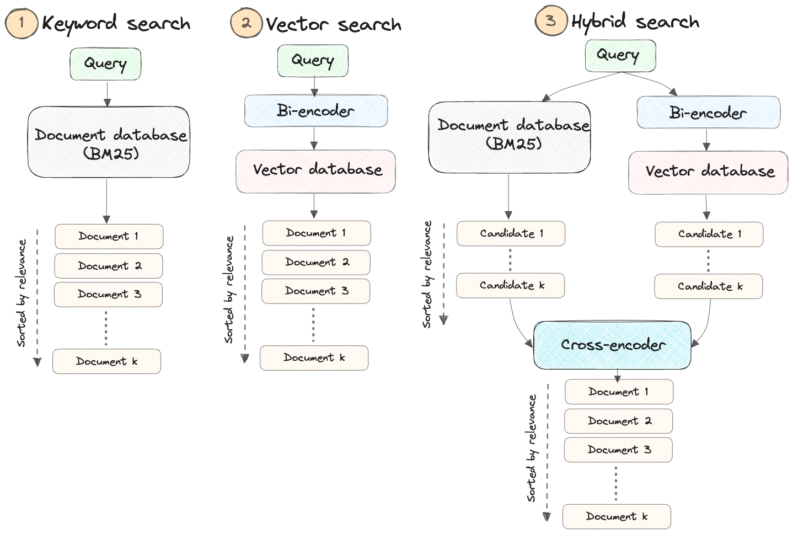
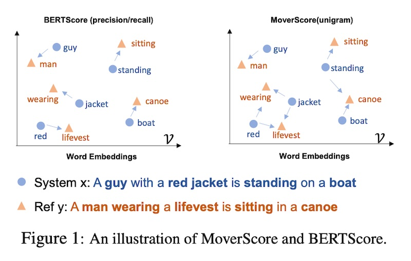

---
categories:
- LLM
- RAG
date: '2023-11-03'
description: Retrieval augmented generation (RAG) 
layout: post
title: 'What you should know about RAG (Retrieved-Augmented Generation)'
toc: true
image: images/rag_cover.png
---

Large language models (LLMs) have unquestionably revolutionized the way we engage with information. Nevertheless, they are not without their limitations, particularly regarding the scope of queries they can effectively handle. Base LLMs (e.g., Llama-2, gpt-series, etc.) are limited to the knowledge contained within their training data, making them less adept at responding to inquiries that demand knowledge beyond their training set. 

Retrieval augmented generation (RAG)-based LLM applications directly tackle this challenge, enabling LLMs to tap into our domain-specific data sources and significantly expand their capacity to provide relevant information.

1. **Access to External Knowledge**: Large language models (LLMs) like GPT-3 or GPT-4 have limitations in terms of the knowledge they possess. They are primarily trained on large text corpora but may not have access to specific or up-to-date information from external sources. RAG allows these models to tap into external knowledge bases, databases, documents, or the web to retrieve relevant and accurate information.
2. **Domain-Specific Expertise**: In many applications, users require domain-specific expertise or information that goes beyond the general knowledge contained in LLMs. RAG enables LLMs to access domain-specific databases or documents, providing specialized answers to queries.
3. **Enhanced Accuracy**: Retrieval can significantly improve the accuracy of responses. By retrieving information from reliable sources, RAG models can validate the information they generate, reducing the risk of producing incorrect or misleading answers.
4. **Data Freshness**: Information retrieved from external sources can be more up-to-date and reflect real-time changes. This is crucial in fields where information quickly becomes obsolete, such as news, finance, or healthcare.

# Challenges

### Hallucinations

While RAG was born to reduce hallucination of a LLM by providing an external knowledge source, it can also introduce new hallucinations. For example, if the retrieval component returns a document that is not relevant to the query, the LLM may generate an answer that is not relevant to the query. 

### Hard to evaluate

Measuring the relevance between paragraphs, especially in question answering or information retrieval, can be a complex task. The relevance assessment is crucial to determine whether a given section contains information directly related to a specific question.

### Put into production

Prototyping a RAG application is easy, but making it performant, robust, and scalable to a large knowledge corpus is hard. While we can easily find many tutorials online with only 10 lines of code telling how easy it is to do a RAG over your own documents, the big challenge still sits there with big number of documents to ingest in production, many queries at the same time with a large number of users etc.

### How RAG typically works?

1. **Retrieval Component**: In the retrieval phase, an external search mechanism is employed to retrieve relevant information or documents from a predefined knowledge base or data source. This can include web pages, databases, documents, or any other structured or unstructured data.
2. **Generation Component**: After retrieving relevant information, the generation component, often powered by an LLM like GPT-3 or GPT-4, takes over. It generates human-readable and contextually relevant responses, using the retrieved information as a source of knowledge.
 

# Retrieval Component

**Hybrid retrieval**, which encompasses both traditional search indexing and embedding-based search, usually yields superior results compared to using either method in isolation. For example, we can complement classical retrieval (BM25 via OpenSearch) with semantic search (`e5-small-v2`).

**Why not rely solely on embedding-based search?**

While embedding-based search excels in many scenarios, it has limitations that become apparent in specific situations, including:

- The search for personal names or object identifiers (e.g., Jonathan)
- The search for acronyms or specialized phrases (e.g., RAG, RLHF)
- The search for unique identifiers (e.g., **`gpt-3.5-turbo`**)

**Why not keyword-based search only?**

However, it's important to note that keyword-based search also has its constraints. It primarily models basic word frequencies and lacks the ability to capture semantic nuances or correlations. Consequently, it struggles with synonyms and hypernyms (words that represent generalizations). This is where the synergy of combining keyword search with semantic search proves advantageous.

## How are embeddings generated?

### OpenAI embeddings

**With regard to embeddings**, the seemingly popular approach is to use [text-embedding-ada-002](https://openai.com/blog/new-and-improved-embedding-model). Its benefits include ease of use via an API and not having to maintain our own embedding infra or self-host embedding models. Nonetheless, personal experience and anecdotes from others suggest there are better alternatives for retrieval.

The OG embedding approaches include Word2vec and [fastText](https://fasttext.cc/). FastText is an open-source, lightweight library that enables users to leverage pre-trained embeddings or train new embedding models. It comes with pre-trained embeddings for 157 languages and is extremely fast, even without a GPU. It’s my go-to for early-stage proof of concepts.

### [Sentence Transformers](https://github.com/UKPLab/sentence-transformers)

It makes it simple to compute embeddings for sentences, paragraphs, and even images. It’s based on workhorse transformers such as BERT and RoBERTa and is available in more than 100 languages.

### Instructor Model Embedding

More recently, instructor models have shown SOTA performance. During training, these models prepend the task description to the text. Then, when embedding new text, we simply have to describe the task to get task-specific embeddings. (Not that different from instruction tuning 
for embedding models IMHO.)

An example is the [E5](https://arxiv.org/abs/2212.03533) family of models. For open QA and information retrieval, we simply prepend documents in the index with `passage:`, and prepend queries with `query:`. If the task is symmetric (e.g., semantic similarity, paraphrase retrieval) or if we want to use embeddings as features (e.g., classification, clustering), we just use the `query:` prefix.

The [Instructor](https://arxiv.org/abs/2212.09741) model takes it a step further, allowing users to customize the prepended prompt: “Represent the `domain` `task_type` for the `task_objective`:” For example, “Represent the Wikipedia document for retrieval:”. (The domain and task objective are optional). This brings the concept of prompt tuning into the field of text embedding.

Check more embedding models in this [Huggingface leaderboard](https://huggingface.co/spaces/mteb/leaderboard)

> It’s important to keep in mind that the lower the dimensionality of the underlying vectors, the more compact the representation is in embedding space, which can affect downstream task quality. Sentence Transformers (sbert) provides embedding models with a dimension *n* in the range of 384, 512 and 768, and the models are completely free and open-source. OpenAI and Cohere embeddings, which require a paid API call to generate them, can be considered higher quality due to a dimensionality of a few thousand. One reason it makes sense to use a paid API to generate embeddings is if your data is multilingual.

## Approximate nearest neighbors (ANN)

After generating and storing the embedding vectors, the objective of similarity search is to retrieve the top-k most similar vectors to the vector associated with a user's search query.

The simplest approach to accomplish this task involves comparing the query vector to each vector in the database, employing the k-nearest neighbor (kNN) method. However, this approach rapidly becomes prohibitively costly as we expand to encompass millions or even billions of data points. This is due to the fact that the number of necessary comparisons increases linearly with the volume of data, making it inefficient at scale. That’s why **approximate nearest neighbors (ANN)** comes in as a rescue.  It optimizes for retrieval speed and returns the approximate (instead of exact) topmost similar neighbors, trading off a little accuracy loss for a large speed up. 

## Indexing Technique

The similarity between two vectors is measured using distance metrics such as cosine distance or dot product. When dealing with vector databases, it is crucial to differentiate between the search algorithm and the underlying **index** on which the Approximate Nearest Neighbor (ANN) search algorithm is executed.

**What is the index?**

Data within a vector database is organized through **indexing**, a process that involves constructing data structures known as indexes. These indexes facilitate efficient vector retrieval by swiftly reducing the search scope. 

This [great blog about indexes from thedataquarry](https://thedataquarry.com/posts/vector-db-3) gives a best overview on this subject. In our blog, we will talk about the most popular ones.

### IVF-PQ

In a simple terms, the IVF part of the index helps us find the right area to search in, like narrowing down which part of a library to look in for a specific book. The PQ part helps us quickly compare the query (what we're looking for) with the actual books (database vectors), making the search faster. It's like having a shortcut to check if a book matches what we want.

When we use both IVF and PQ together, we get a big boost in speed because PQ helps with speed, and IVF helps us find more of the right books, improving the chances of finding what we're looking for. 

### Hierarchical Navigable Small Words (HNSW)

The Hierarchical Navigable Small-World (HNSW) graph algorithm is widely regarded as one of the most popular methods for constructing vector indexes. In fact, many database vendors currently favor it as their primary choice. 

## Retrieval Approaches

Various approaches to the retrieval mechanism have been proposed to get requisite context as well as overcome the challenges involved. They range from simple approaches to sophisticated multi step processes, some of them involving the LLM itself in pre-processing steps.

Some of the approaches are:

***Simple***

- Fetch relevant documents (top k) based on the query or input.
- Consider all retrieved documents as part of the context for generating the response.
- All documents are treated equally and incorporated into the generation process.

***Map Reduce:***

- Fetch relevant documents based on the query or input.
- Retrieve responses from the model for each document.
- Combine the individual responses generated for each document to produce the final response via LLM.

***Map Refine:***

- Fetch relevant documents based on the query or input.
- Retrieve the response from the first document.
- Use this initial response and subsequent documents to refine the response iteratively.
- Repeat this refinement process until a final answer or response is obtained.

***Map Rerank:***

- Fetch relevant documents based on the query or input.
- Retrieve responses for all documents individually
- Apply a ranking model or algorithm to rank the responses.
- Select the best-ranked response as the final answer or response.

***Filtering:***

- Query for relevant documents based on the query or input.
- Apply a model to further filter the document set.
- Use the filtered documents as the context for generating the response.

***Contextual Compression:***

- Query for relevant documents based on the query or input.
- Apply a model to filter the documents based on relevancy and extract only relevant snippets from each document.
- Utilize these relevant snippets to generate a concise and informative response.

***Summary Based Index:***

- Relevant for a document repository with document summaries.
- Large documents can be broken down into smaller manageable snippets..
- A summary of the entire document too is created.
- Snippets are linked to the summary.
- Index document snippets along with document summaries.
- Query for relevant document summaries.
- Collect the snippets from the relevant summaries to form the document set.
- Use the document set to generate a response.

***Forward-Looking Active REtrieval augmented generation (FLARE):***

- Look up an initial set of relevant documents.
- Use this initial set and query to predict the upcoming sentence.
- Check for the confidence level of the predicted tokens.
- If the confidence level is high then continue predicting the next sentence.
- Else use the predicted sentence as a query to look up more relevant documents.
- Iteratively continue the process to generate the full response.

# RAG’s evaluation

Evaluating RAG is very important but it’s tricky because this involves so many moving parts. 

There’s two general strategies for evaluating your LLM app: 

- End-to-end : Just evaluate on the quality of your text outputs
- Component-wise : Evaluate each component first (retrieval, single LLM call), and then gradually stitch them together into an overall system.

|  | End-to-end | Component-wise  |
| --- | --- | --- |
| Pros | Way easier to setup. Frameworks like llama_index or langchain give you the ability to define RAG systems/agents quickly. Prototype your idea quickly without getting lost in the component details. Also you don’t need labels for individual components, which can be tedious. Simply run LLM-evals on text inputs/outputs. | More easily pin-point each component step by step. For instance, you can first validate that your retrieval is good before composing it into a RAG system. That way you have confidence that parts on their own are working properly. |
| Cons | Hard to pinpoint the source of failures (is it retrieval? Is it LLM hallucination?). If there are failures, you will have to break your existing abstractions to then isolate and test each component anyways. Exponential number of combinations to try for performance improvement. | Can be tedious to get started, since we first have to validate each component before building any system. Getting labeled outputs for every component or every subset of components can be time-consuming or in the worst case impossible. |

## Component-wise Evaluation

### Embedding

The first component that you want to evaluate is the embedding model. It helps to look at how well the model is performing on a diverse set of domains or tasks. A useful benchmark for embeddings is the [MTEB Leaderboard](https://huggingface.co/spaces/mteb/leaderboard).

### Retrieval

One of the most important question is how we can measure the score of similarity between our retrieval predictions and our ground truth answer. 

**Classical metrics**

The commonly used metrics such as BLEU, ROUGE, BERTScore, and MoverScore. 

**[BLEU](https://dl.acm.org/doi/10.3115/1073083.1073135) (Bilingual Evaluation Understudy)** is a precision-based metric: It counts the number of n-grams in the generated output that also show up in the reference, and then divides it by the total number of words in the output. It’s predominantly used in machine translation and remains a popular metric due to its cost-effectiveness.

$$
\text{precision}_n = \frac{\sum_{p \in \text{output}} \sum_{\text{n-gram} \in p} \text{Count}_{\text{clip}} (\text{n-gram})}{\sum_{p \in \text{output}} \sum_{\text{n-gram} \in p} \text{Count}(\text{n-gram})}
$$

**[ROUGE](https://aclanthology.org/W04-1013/) (Recall-Oriented Understudy for Gisting Evaluation)**: In contrast to BLEU, ROUGE is recall-oriented. It counts the number of words in the reference that also occur in the output. It’s typically used to assess automatic summarization tasks.

There are several ROUGE variants. ROUGE-N is most similar to BLEU in that it also counts the number of matching n-grams between the output and the reference.

$$
\text{ROUGE-N} = \frac{\sum_{s_r \in \text{references}} \sum_{n\text{-gram} \in s_r} \text{Count}_{\text{match}} (n\text{-gram})}{\sum_{s_r \in \text{references}} \sum_{n\text{-gram} \in s_r} \text{Count} (n\text{-gram})}
$$

Other variants include:

- ROUGE-L: This measures the longest common subsequence (LCS) between the output and the reference. It considers sentence-level structure similarity and zeros in on the longest series of co-occurring in-sequence n-grams.
- ROUGE-S: This measures the skip-bigram between the output and reference. Skip-bigrams are pairs of words that maintain their sentence order regardless of the words that might be sandwiched between them.

**[BERTScore](https://arxiv.org/abs/1904.09675)** is an embedding-based metric that uses cosine similarity to compare each token or n-gram in the generated output with the reference sentence. There are three components to BERTScore:

- Recall: Average cosine similarity between each token in the reference and its closest match in the generated output.
- Precision: Average cosine similarity between each token in the generated output and its nearest match in the reference.
- F1: Harmonic mean of recall and precision

$$
Recall_{\text{BERT}} = \frac{1}{|r|} \sum_{i \in r} \max_{j \in p} \vec{i}^T \vec{j}, \quad Precision_{\text{BERT}} = \frac{1}{|p|} \sum_{j \in p} \max_{i \in r} \vec{i}^T \vec{j}
$$

$$
\text{BERTscore} = F_{\text{BERT}} = \frac{2 \cdot P_{\text{BERT}} \cdot R_{\text{BERT}}}{P_{\text{BERT}} + R_{\text{BERT}}}
$$

BERTScore is useful because it can account for synonyms and paraphrasing. Simpler metrics like BLEU and ROUGE can’t do this due to their reliance on exact matches. BERTScore has been shown to have better correlation for tasks such as image captioning and machine translation.

**[MoverScore](https://arxiv.org/abs/1909.02622)** also uses contextualized embeddings to compute the distance between tokens in the generated output and reference. But unlike BERTScore, which is based on one-to-one matching (or “hard alignment”) of tokens, MoverScore allows for many-to-one matching (or “soft alignment”).

**Use a strong LLM as a reference-free metric**

Ideally, we would have humans interpret if the output quality is good. Human raters, however, are extremely resource-intensive and not practical at scale. GPT-4 has been used as a fairly good proxy to human-raters. You may want to consider prompt engineering techniques such as [few shot prompting](https://www.promptingguide.ai/techniques/fewshot), [chain-of-thought](https://www.promptingguide.ai/techniques/cot), and [self-consistency](https://www.promptingguide.ai/techniques/consistency) to generate more reliable evaluation results from GPT-4.

## End-to-end evaluation

When coming to end-to-end evaluation, you can consider Ragas. [Ragas](https://github.com/explodinggradients/ragas) is an open-source evaluation framework for RAG pipeline

Ragas measures your pipeline's performance against different dimensions

1. **Faithfulness**: measures the information consistency of the generated answer against the given context. If any claims are made in the answer that cannot be deduced from context is penalized. It is calculated from `answer` and `retrieved context`.
2. **Context Precision**: measures how relevant retrieved contexts are to the question. Ideally, the context should only contain information necessary to answer the question. The presence of redundant information in the context is penalized. It is calculated from `question` and `retrieved context`.
3. **Context Recall**: measures the recall of the retrieved context using annotated answer as ground truth. Annotated answer is taken as proxy for ground truth context. It is calculated from `ground truth` and `retrieved context`.
4. **Answer Relevancy**: refers to the degree to which a response directly addresses and is appropriate for a given question or context. This does not take the factuality of the answer into consideration but rather penalizes the present of redundant information or incomplete answers given a question. It is calculated from `question` and `answer`.
5. **Aspect Critiques**: Designed to judge the submission against defined aspects like harmlessness, correctness, etc. You can also define your own aspect and validate the submission against your desired aspect. The output of aspect critiques is always binary. It is calculated from `answer`.

# Ways to improve RAG’s performance?

## Data source and parameters tuning

### Pay attention to base documents
The most important part of RAG is data source which creates a base knowledge for the LLM to generate the answer. The quality of the base documents will directly affect the quality of the answer. Are documents broken out logically? Are topics covered in one place or many separate places? If you, as a human, can’t easily tell which document you would need to look at to answer common queries, your retrieval system won’t be able to either. To improve the quality of answer, we should do some sorts preprocessing / cleaning / filtering to the base documents. 

### Tune different indexing / chunking approaches
One of the most common strategies for improving retrieval performance is to experiment with different indexing and chunking approaches. For example, you can try different chunk sizes, chunk overlap, and chunking strategies (e.g., sentence, paragraph, etc.). 
### Adding meta-data for filtering

A highly effective strategy for enhancing the retrieval process involves augmenting your data chunks with metadata, which can subsequently be leveraged to refine result processing. One commonly used metadata tag is the "date" because it facilitates filtering by recency. 

### Iterate over your prompt
You can hack the RAG such that you do allow the LLM to rely on its own knowledge if it can’t find a good answer in the context or adaptes different styles for the answer.  

### Fine-tune your embedding model.

Finetuning a model means updating the model itself over a set of data to improve the model in a variety of ways. This can include improving the quality of outputs, reducing hallucinations, memorizing more data holistically, and reducing latency/cost. Finetuning the embedding model can allow for more meaningful embedding representations over a training distribution of data –> leads to better retrieval performance.

## Retrieval Logic

### Decoupling Chunks Used for Retrieval vs. Chunks Used for Synthesis

The most effective way to represent information for retrieval could differ from the most effective approach for synthesis. For example, a raw text chunk may provide essential details that help the language model generate a comprehensive response to a query. However, it might also contain extraneous filler words or information that could skew the embedding representation. Additionally, it may lack sufficient global context and might not be retrieved when a relevant query is received. In that sense, we can embed a document summary, which links to chunks associated with the document or embed a sentence which links to a window around the sentence. 

### Structured Retrieval for Larger Document Sets

A significant drawback of the standard RAG stack, which involves top-k retrieval and basic text splitting, becomes evident when dealing with a large number of documents, such as 100 different PDFs. In this scenario, when you have a query, it's often essential to utilize structured information to enhance precision in retrieval. For instance, if your question pertains to only two specific PDFs, relying solely on raw embedding similarity with text chunks may not be sufficient.

One effective approach to address this issue is to embed document summaries and establish a mapping to text chunks within each document. This enables retrieval at the document level initially, prioritizing the identification of relevant documents before delving into chunk-level analysis.

## Caching

### Semantic cache results

Traditional caching systems use various techniques to store data or queries so that when another user asks the same or similar query, you don’t have to make a full round trip to generate the same context. However, traditional caching systems use an exact keyword match, which doesn’t work with LLMs where the queries are in natural language. So, how do you ensure you’re not performing a full retrieval each time when the queries are similar?

This is where [CacheGPT](https://github.com/zilliztech/GPTCache) comes in. CacheGPT uses semantic search to match queries against previously asked queries, and if there’s a match, you simply return the last context instead of performing a full retrieval. CacheGPT is an open-source library, and you can refer to its [documentation](https://gptcache.readthedocs.io/en/latest/usage.html) to configure it to your requirements.

# Reference

1. [ACL 2023 Tutorial](https://www.notion.so/Retrieval-Augmented-Generation-RAG-453d3fd10527440a97285f52083623fb?pvs=21) 
2. [Massive Text Embedding Benchmark (MTEB) leaderboard.](https://huggingface.co/spaces/mteb/leaderboard)   
3. [Benchmarks of approximate nearest neighbor libraries in Python](https://github.com/erikbern/ann-benchmarks) 
4. [10 Ways to Improve the Performance of Retrieval Augmented Generation Systems](https://towardsdatascience.com/10-ways-to-improve-the-performance-of-retrieval-augmented-generation-systems-5fa2cee7cd5c)
5. [Not all indexes are created equal](https://thedataquarry.com/posts/vector-db-3/) 
6. [RAGAS: Evaluation framework for your Retrieval Augmented Generation (RAG) pipelines](https://github.com/explodinggradients/ragas)
7. [Patterns for Building LLM-based Systems & Products](https://eugeneyan.com/writing/llm-patterns/)
8. [Building Performant RAG Applications for Production](https://docs.llamaindex.ai/en/stable/optimizing/production_rag.html)